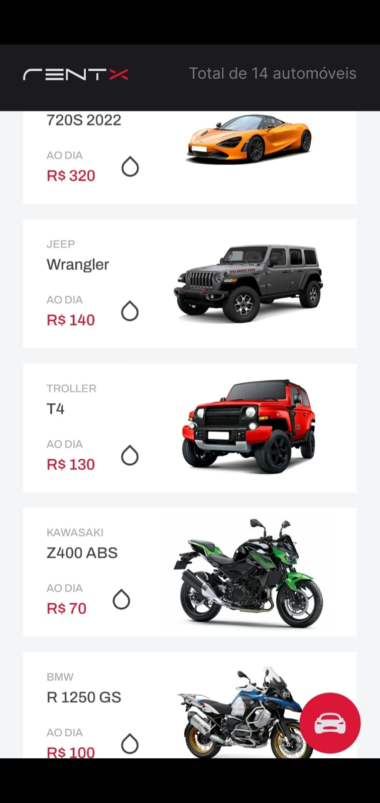
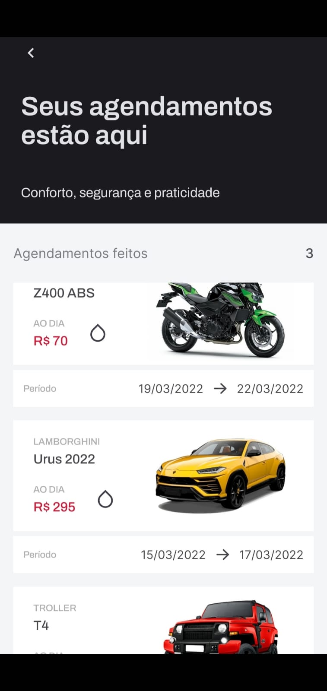
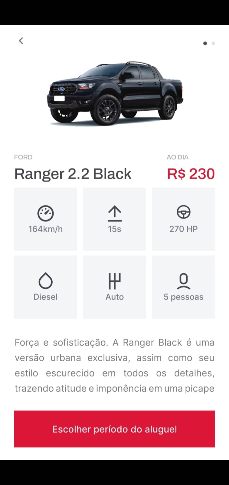
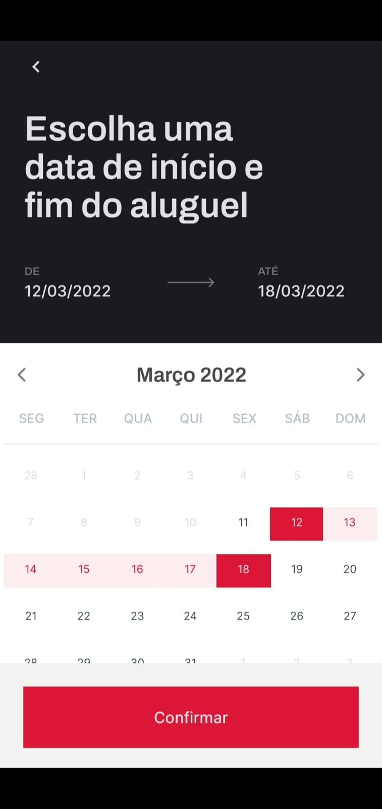
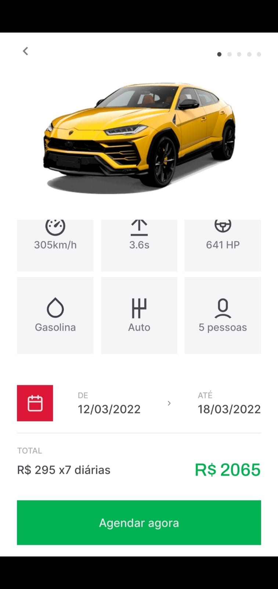
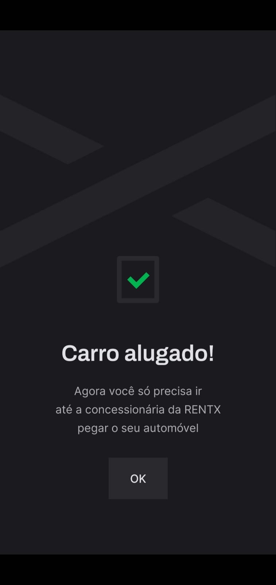

# 🚗 RentX
  
  

## 💡 Tecnologias

- API Rest
- JSON Server
- Reanimated 2
- Lottie

## 📝 Projeto
Rent X é um aplicativo em que o usuário escolhe um carro para alugar pela quantidade de dias que desejar. Após efetuar o aluguel, basta o usuário ir à concessionária pegar o carro alugado no dia marcado.

